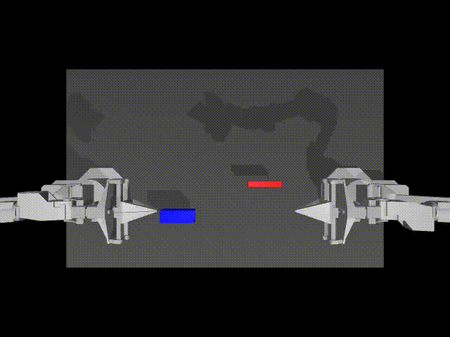

## Task 1 + Task 2 (Embodied AI)

This repository contains two tasks:

- **Task 1**: SmolVLA + LeRobot policy inference in MuJoCo (ALOHA insertion)
- **Task 2**: Vision-based teleoperation (hand video → VX300s right arm) with from-scratch IK in MuJoCo

### Folder structure

- **`task1/`**: code + reports + result video
- **`task2/`**: code + assets + result video(s)

Each task folder has its own `README.md` with **conda env setup** and **how to run**.

### Results

- **Task 1 (SmolVLA inference) video**: [`task1/results/task1_partb_seed1_prompted_500.mp4`](task1/results/task1_partb_seed1_prompted_500.mp4)
- **Task 2 (Teleop 3-panel) video**: [`task2/results/teleop_hand_yolo_depth_robot.mp4`](task2/results/teleop_hand_yolo_depth_robot.mp4)

#### Task 1 preview (GIF, slowed)

#### Task 2 preview (GIF, slowed)

### Reports (Task 1)

- Part A: [`task1/reports/task1-part-A.pdf`](task1/reports/task1-part-A.pdf)
- General report: [`task1/reports/task-1-report.pdf`](task1/reports/task-1-report.pdf)

